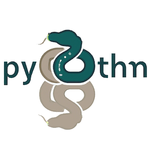

#### python 之禅

```
Beautiful is better than ugly. 美胜于丑。
Explicit is better than implicit. 显式比隐式好。
Simple is better than complex. 简单总比复杂好。
Complex is better than complicated. 复杂总比复杂好。
Flat is better than nested. 平的比嵌套的好。
Sparse is better than dense. 稀疏比密集好。
Readability counts. 可读性很重要。
Special cases aren't special enough to break the rules. 特殊情况不足以违反规则。
Although practicality beats purity. 虽然实用胜过纯洁。
Errors should never pass silently. 错误永远不应该悄无声息地过去。
Unless explicitly silenced. 除非明确沉默。
In the face of ambiguity, refuse the temptation to guess. 面对模棱两可的情况，拒绝猜测的诱惑。
There should be one-- and preferably only one --obvious way to do it. 应该有一个——最好只有一个——显而易见的方法来做到这一点。
Although that way may not be obvious at first unless you're Dutch. 虽然这种方式一开始可能并不明显，除非你是荷兰人。
Now is better than never. 现在总比没有好。
Although never is often better than right now. 虽然永远都比现在好。
If the implementation is hard to explain, it's a bad idea. 如果实现很难解释，那就不是个好主意。
If the implementation is easy to explain, it may be a good idea. 如果实现很容易解释，这可能是一个好主意。
Namespaces are one honking great idea -- let's do more of those! 名称空间是一个非常好的主意——让我们做更多的工作吧！
```

#### Python 基础面试题（16 个）

Python 的作者？

Python 类型鉴别？

Python 的基本数据类型？

Python 中的 `*args` 和 `**kwargs` 表示什么？

Python 语法中 “==” 和 “is” 的区别是什么？

Python 中为什么没有函数重载？

介绍用过 Python 标准库中的哪些模块？

什么是鸭子类型（duck typing）？

说一下 Python2 和 Python3 的区别？

什么是 Lambda 函数？

正则表达式的 match 方法和 search 方法有什么区别？

什么是 Python 中的魔术方法？

说一下你对 Python 中模块和包的理解？

什么情况下会出现 `KeyError`、`TypeError`、`ValueError`？

说说对 Python 中的浅拷贝和深拷贝的理解？

说一下 Python 中变量的作用域？
